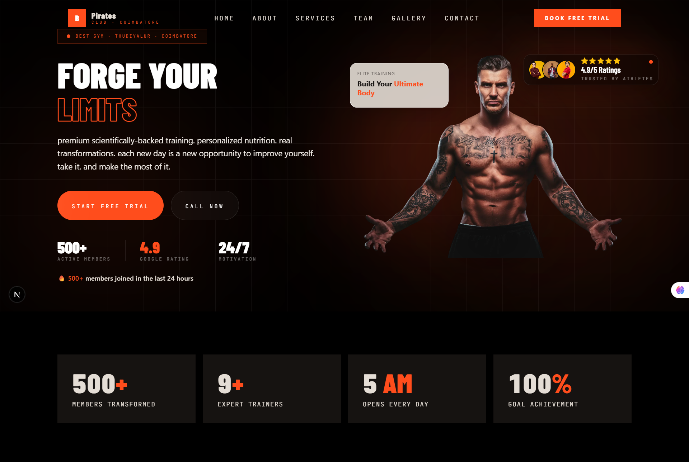

<<<<<<< HEAD
# 🏴‍☠️ Pirates Club — Elite Fitness Experience

> A cinematic, high-performance gym landing experience crafted with **Next.js 15**, **Tailwind CSS v4**, **Framer Motion**, and a dark industrial visual system inspired by luxury fitness brands.

Built for premium gyms, transformation studios, personal trainers, and modern fitness startups that want more than a generic website.

---

# ⚡ Tech Stack

| Technology | Purpose |
|---|---|
| Next.js App Router | Modern React Framework |
| Tailwind CSS v4 | Utility-first styling |
| Framer Motion | Smooth premium animations |
| TypeScript | Scalable codebase |
| Lucide React | Icon system |
| Next/Image | Optimized image loading |

---

# ✨ Core Experience

### 🎬 Cinematic Hero Section
- Animated typography
- Floating glass cards
- Dynamic glow effects
- Premium motion choreography

### 💎 Luxury UI System
- Dark industrial aesthetic
- Frosted glass components
- Orange energy accents
- Smooth hover interactions

### 📱 Responsive Experience
- Desktop premium layouts
- Mobile swipe carousels
- Sticky floating CTA
- Gesture-friendly interactions

### ⚡ Advanced Motion
- Framer Motion powered transitions
- Scroll-triggered reveals
- Magnetic hover effects
- Smooth drag snapping

---

# 🚀 Hero Banner
<p align="center">
  
</p>

---

# 🧩 Included Sections

| Section | Features |
|---|---|
| Hero | Animated premium landing section |
| Stats | Scroll-triggered counters |
| About | Storytelling split layout |
| Services | Swipe carousel + hover cards |
| Team | Luxury trainer profiles |
| Gallery | Transformation showcase |
| Pricing | Premium membership plans |
| FAQ | Smooth accordion animations |
| Events | Fitness event banners |
| Contact | Luxury inquiry section |
| Sticky CTA | Floating desktop/mobile CTA |
| Booking Modal | Premium popup booking flow |
| Footer | Socials + navigation |

---

# 🎨 Design Language

| Token | Value |
|---|---|
| Primary Accent | `#FF4D1C` |
| Background | `#050505` |
| Card Surface | `#101010` |
| Text Primary | `#F5EFE8` |
| Glass Blur | `backdrop-blur-2xl` |
| Radius Style | `rounded-[32px]` |

---

# 🚀 Quick Start

## 1. Create Project

```bash
npx create-next-app@latest pirates-club
cd pirates-club
```

---

## 2. Install Dependencies

```bash
npm install framer-motion lucide-react lenis
```

---

## 3. Start Development

```bash
npm run dev
```

Open:

```bash
http://localhost:3000
```

---

# 📂 Recommended Structure

```bash
app/
 ├── layout.tsx
 ├── page.tsx
 ├── globals.css

components/
 ├── Hero.tsx
 ├── About.tsx
 ├── Services.tsx
 ├── Gallery.tsx
 ├── Pricing.tsx
 ├── FAQ.tsx
 ├── Contact.tsx
 ├── Footer.tsx
 ├── StickyCTA.tsx
 └── reusable/

assets/
 ├── images/
 └── icons/

utils/
 └── data.ts
```

---

# 🖼️ Assets

Place media inside:

```bash
/assets/images
```

Example:

```bash
/assets/images/team/
/assets/images/gallery/
/assets/images/hero/
```

---

# ⚙️ SEO Optimized

### Included:
- Metadata API
- OpenGraph tags
- Semantic structure
- Mobile responsiveness
- Optimized image loading
- Performance-friendly animations

### Recommended Next Steps:
- Add sitemap.xml
- Add robots.txt
- Add schema markup
- Compress images to WebP
- Add Google Analytics

---

# 🌊 Smooth Scrolling

This project supports buttery smooth scrolling using:

```bash
lenis
```

Already optimized for:
- Tailwind CSS v4
- Framer Motion
- Scroll animations
- Mobile performance

---

# 📱 Mobile Experience

### Includes:
- Swipeable sliders
- Drag momentum
- Snap scrolling
- Floating bottom CTA
- Touch-friendly layouts

---

# 🧠 Performance Focus

- Optimized animations
- GPU accelerated transforms
- Lazy-loaded visuals
- Reduced layout shifts
- Minimal re-renders

---

# 🚀 Deployment

## Vercel

```bash
npm run build
```

or

```bash
npx vercel
```

---

# 🔥 Ideal For

- Premium gyms
- Fitness startups
- Personal trainers
- Luxury fitness brands
- Transformation studios
- Sports performance centers

---

# 🏴‍☠️ Brand Philosophy

> “Forge discipline. Build power. Become unstoppable.”

---

# 📜 License

Free for personal and commercial use.

---

# 👨‍💻 Crafted With

- Next.js
- Tailwind CSS
- Framer Motion
- Pure obsession for premium UI/UX
=======
# pirates-club
Premium gym &amp; fitness website with cinematic UI, smooth scrolling, glassmorphism, advanced animations, and elite branding.
>>>>>>> 33047dc51e59d869b7bba20b1cb171cc25d5a98a
